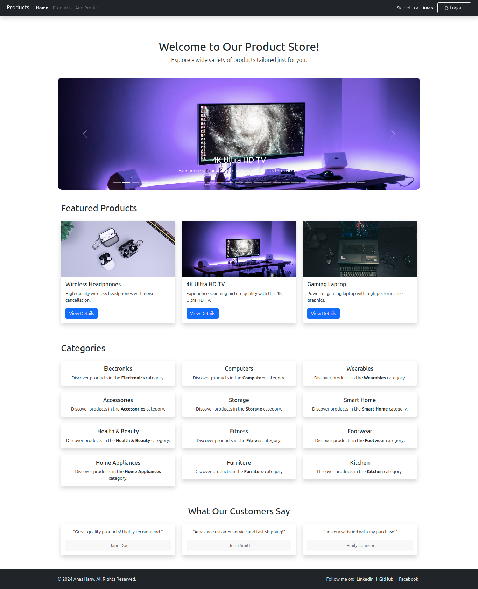

# 🛒 React.js Products

Welcome to the **React.js Products** project! This application showcases a collection of products using React.js, demonstrating essential concepts such as component-based architecture, state management, and responsive design.

## 🌟 Features

- Browse through a variety of products
- Responsive design for all devices
- User-friendly interface
- Built with React.js

## 🛠️ Technologies Used

- **React.js**: A JavaScript library for building user interfaces
- **CSS**: Styling the application
- **JavaScript**: Core programming language used

## 🚀 Getting Started

Follow these steps to get your development environment set up:

### Prerequisites

Make sure you have [Node.js](https://nodejs.org/) installed on your machine.

### Installation

1. Clone the repository:
   ```bash
   git clone https://github.com/AnasHany219/React.Js-Products.git
   ```
2. Navigate to the project directory:
   ```bash
   cd React.Js-Products
   ```
3. Install the dependencies:
   ```bash
   npm install
   ```

### Running the Application

To start the application, run:

```bash
npm start
```

The application will be available at `http://localhost:3000`.

## 📸 Screenshots

### Home Page



### Products Page


## 🙌 Acknowledgments

- Thanks to the React.js community for their invaluable resources and support!

Feel free to contribute or raise issues if you find any bugs or have suggestions for improvements!

## 💬 Contact

If you have any questions, feel free to reach out:

- [LinkedIn](https://www.linkedin.com/in/anashany219/)
- [GitHub](https://github.com/AnasHany2193)

Happy coding! 🎉
